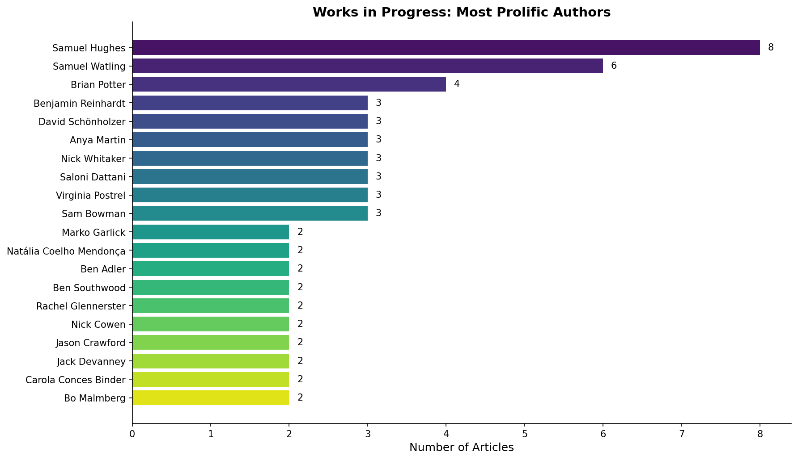
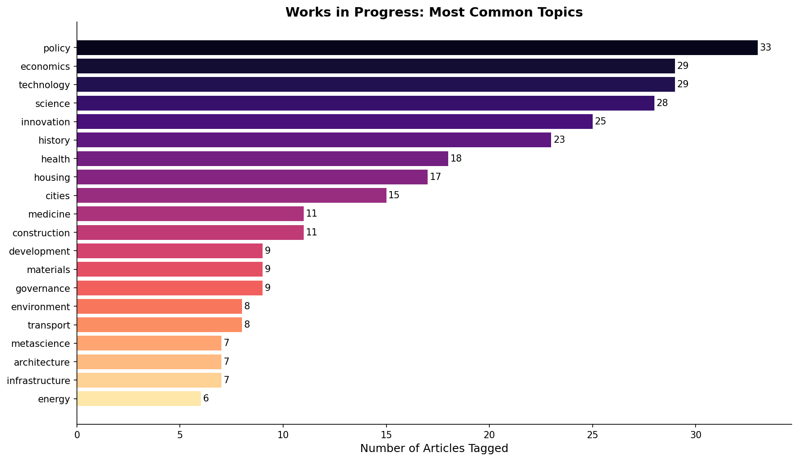
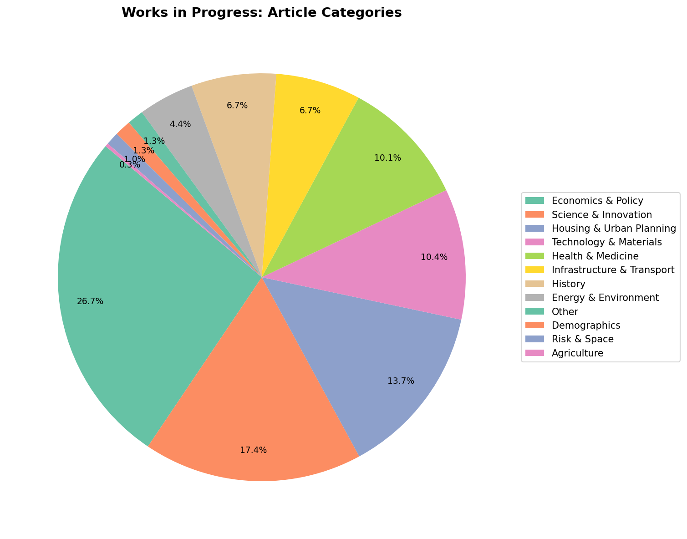
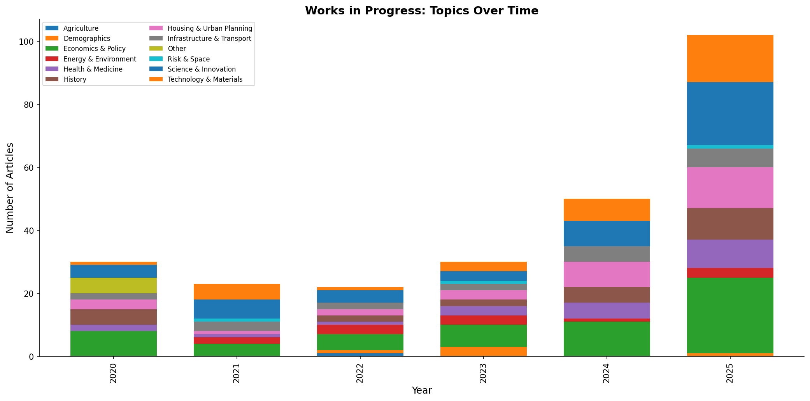
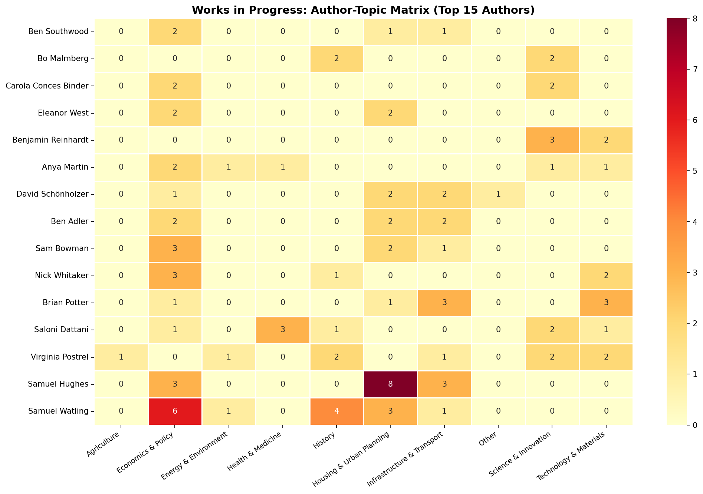
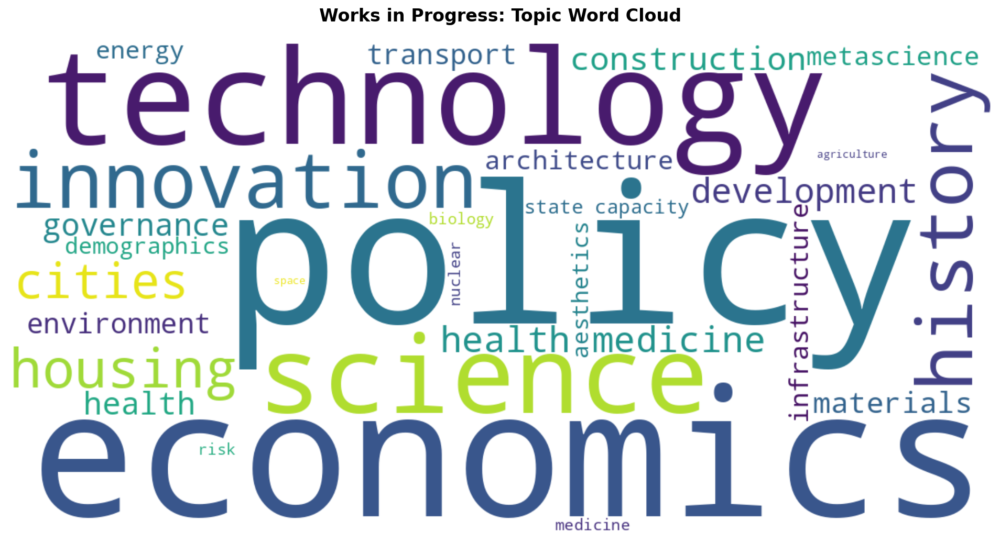
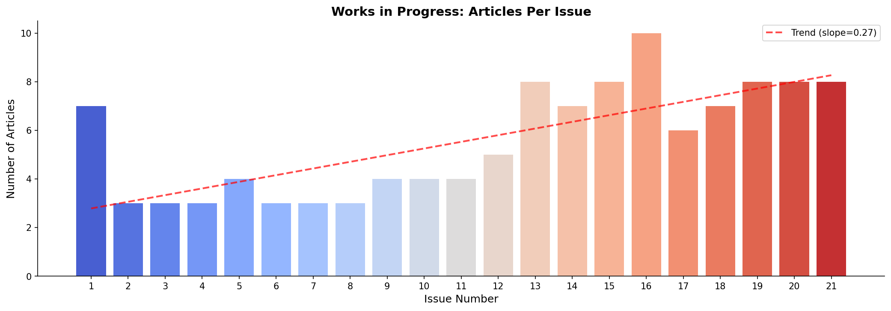
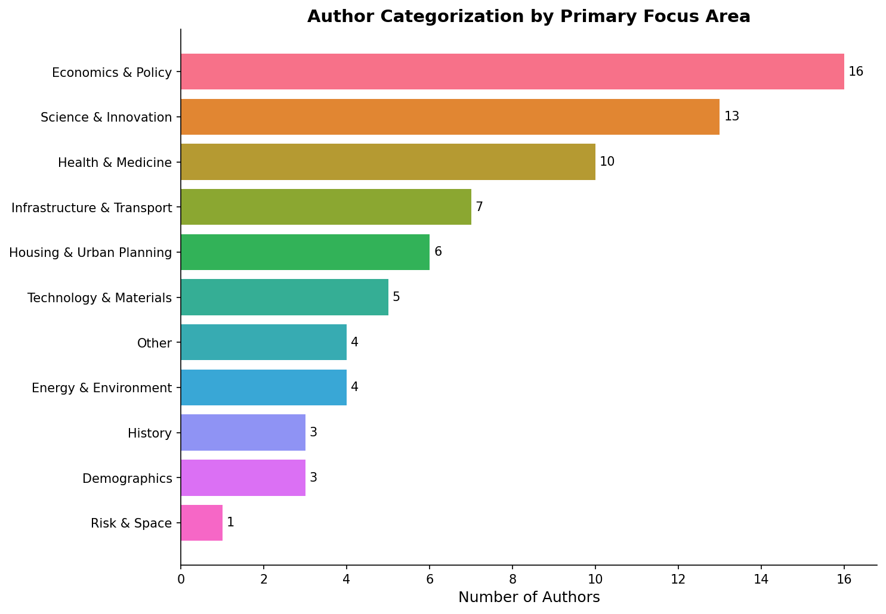
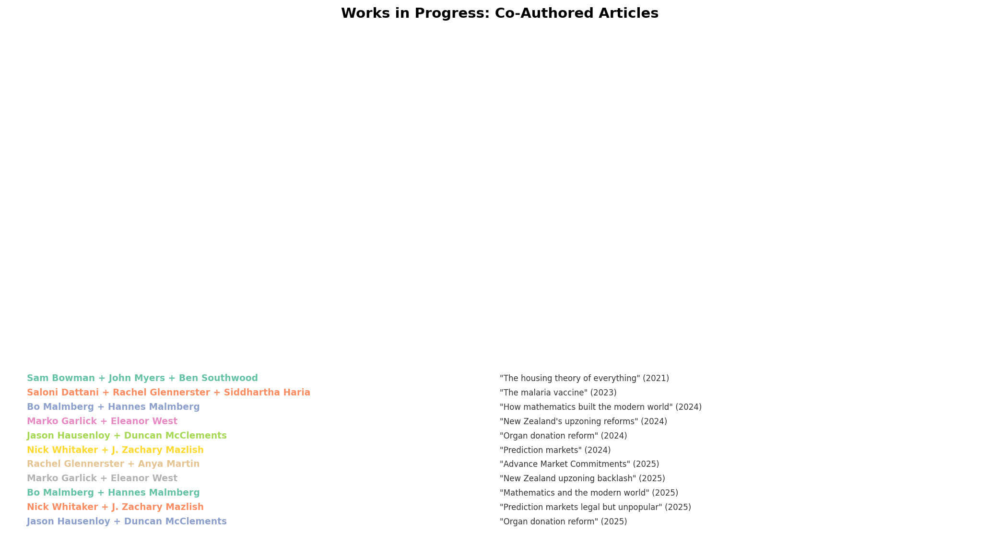

# Works in Progress Magazine: Author & Topic Analysis

<!-- AI-GENERATED-NOTE -->
> [!NOTE]
> This is an AI-generated research report. All text and code in this report was created by an LLM (Large Language Model). For more information on how these reports are created, see the [main research repository](https://github.com/simonw/research).
<!-- /AI-GENERATED-NOTE -->

An automated categorization and visualization of [Works in Progress](https://worksinprogress.co/) magazine — a publication dedicated to ideas about progress in science, technology, economics, and society.

## Overview

Works in Progress was founded in 2020 by Sam Bowman, Saloni Dattani, Nick Whitaker, and Ben Southwood, initially funded by an Emergent Ventures grant and now part of Stripe. The magazine publishes long-form analytical essays on topics ranging from housing policy to nuclear energy to the history of mathematics.

### Dataset Summary

| Metric | Value |
|--------|-------|
| Total articles cataloged | ~116 |
| Total issues analyzed | 21 (2020–2025) |
| Unique authors | 72 |
| Fine-grained topic tags | 28 |
| Broad categories | 11 |

## Author Categorization

### Most Prolific Authors

| Author | Articles | Primary Focus | Affiliation |
|--------|----------|---------------|-------------|
| Samuel Hughes | 8 | Housing & Architecture | Editor, Oxford philosopher |
| Samuel Watling | 6 | Policy & History | Regular contributor |
| Brian Potter | 4 | Construction & Infrastructure | Construction Physics newsletter |
| Benjamin Reinhardt | 3 | Science & Materials | Independent researcher |
| David Schönholzer | 3 | Infrastructure & Transport | Economist |
| Saloni Dattani | 3 | Health & Medicine | Founding editor, PhD genetics |
| Virginia Postrel | 3 | Technology & History | Author, columnist |
| Nick Whitaker | 3 | Economics & Policy | Founding editor |
| Sam Bowman | 3 | Economics & Policy | Founding editor |
| Anya Martin | 3 | Economics & Development | Regular contributor |

### Author Categories

Authors fall into several natural groupings:

- **Housing & Urban Planning specialists**: Samuel Hughes, Emily Hamilton, Tal Alster, Marko Garlick, Javid Lakha
- **Economics & Policy writers**: Sam Bowman, Nick Whitaker, Samuel Watling, Carola Conces Binder, Judge Glock
- **Science & Innovation writers**: Benjamin Reinhardt, Jason Crawford, Eli Dourado, Bo & Hannes Malmberg
- **Health & Medicine experts**: Saloni Dattani, Stephan J. Guyenet, Rachel Glennerster, Keller Scholl
- **Infrastructure & Transport**: Brian Potter, David Schönholzer, Ben Adler, Tamara Winter
- **Technology & Materials**: Virginia Postrel, Hiawatha Bray
- **History**: Anton Howes, Mark Koyama, Stewart Brand

### Editorial Team vs. Contributors

The editorial team (Bowman, Dattani, Southwood, Whitaker, Hughes, Postrel, Garicano, Edwards, Babu, Chalmers) also regularly contributes articles. Samuel Hughes and Saloni Dattani are the most prolific editor-authors.

## Topic Analysis

### Broad Category Distribution

1. **Economics & Policy** — 26.7% of all topic tags
2. **Science & Innovation** — 17.4%
3. **Housing & Urban Planning** — 13.7%
4. **Technology & Materials** — 10.4%
5. **Health & Medicine** — 10.1%
6. **Infrastructure & Transport** — 6.7%
7. **History** — 6.7%
8. **Energy & Environment** — 4.4%
9. **Demographics** — 1.3%
10. **Risk & Space** — 1.0%

### Top Fine-Grained Topics

1. Policy (33 articles)
2. Economics (29)
3. Technology (29)
4. Science (28)
5. Innovation (25)
6. History (23)
7. Health (18)
8. Housing (17)
9. Cities (15)
10. Medicine (11)

### Topics Over Time

The magazine has evolved since its 2020 launch:
- **2020**: Focused on state capacity, governance, and foundational progress studies themes
- **2021**: Expanded into housing (The Housing Theory of Everything), health (weight loss/GLP-1), and energy
- **2022**: Broader coverage including environment (acid rain), infrastructure (maintenance), and demographics
- **2023**: More health/medicine (malaria vaccines), architecture (beauty of concrete), and fertility
- **2024–2025**: Largest output period with diverse coverage across all categories; increased emphasis on materials science, transport infrastructure, and international housing policy

## Visualizations

The following charts were generated by `analyze_and_visualize.py`:

### 1. Most Prolific Authors

### 2. Topic Distribution

### 3. Article Categories (Pie)

### 4. Topics Over Time

### 5. Author-Topic Heatmap

### 6. Topic Word Cloud

### 7. Articles Per Issue

### 8. Author Categorization

### 9. Co-Authored Articles

## Key Insights

1. **Housing is the signature topic**: While Economics & Policy is the broadest category, housing/urban planning articles are the magazine's most distinctive and viral content ("The Housing Theory of Everything" is their most-read piece ever).

2. **The magazine has grown significantly**: From ~3 articles per issue in 2020 to 7-10 per issue in 2024-2025, with an upward trend in total output.

3. **Most authors are one-time contributors**: Only ~20 of 72 authors have written 2+ articles. The magazine draws from a wide network of academics, journalists, and independent researchers.

4. **Strong progress studies orientation**: Nearly every article connects to the theme of understanding and promoting human progress — whether through better housing policy, scientific breakthroughs, or historical lessons.

5. **Interdisciplinary by design**: Top authors like Samuel Hughes and Samuel Watling span multiple categories, and the magazine deliberately mixes hard science, economics, history, and policy.

## Files

- `wip_data.py` — Structured dataset of all articles, authors, topics, and metadata
- `analyze_and_visualize.py` — Analysis and visualization generation script
- `analysis_summary.json` — Machine-readable summary of all analysis results
- `notes.md` — Research notes and methodology
- `README.md` — This report
- `*.png` — Generated visualizations (9 charts)

## Methodology

Data was collected via systematic web searches of worksinprogress.co, cross-referenced with their Substack newsletter, Muck Rack profile, and individual article pages. Articles were manually tagged with fine-grained topics (28 tags) which were then grouped into 11 broad categories. Author bios were sourced from the /our-authors/ page. The dataset is approximate — some early issues (1-9) have incomplete coverage due to limited search indexing of older content.
